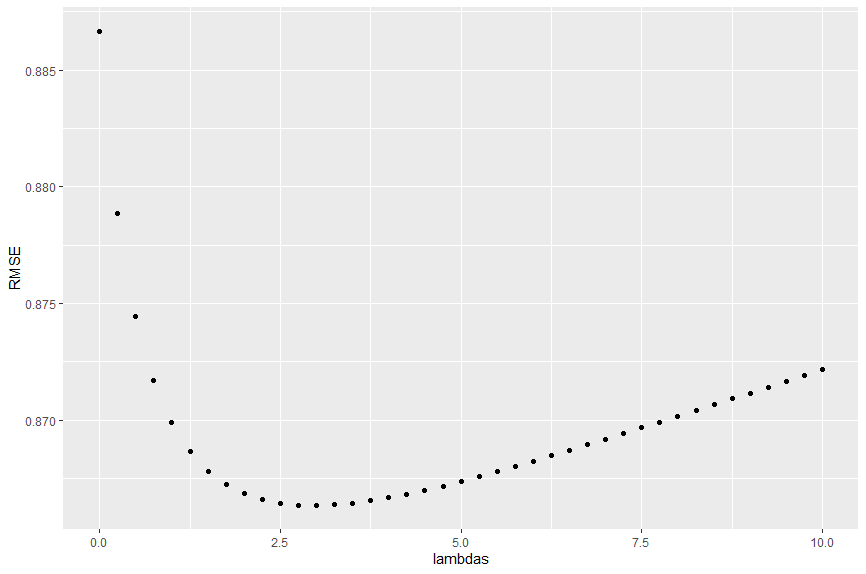
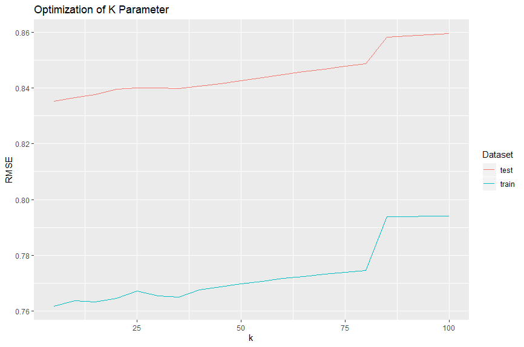
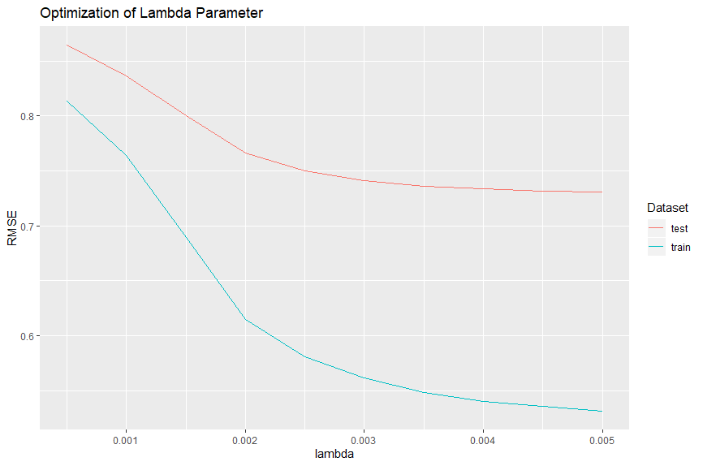
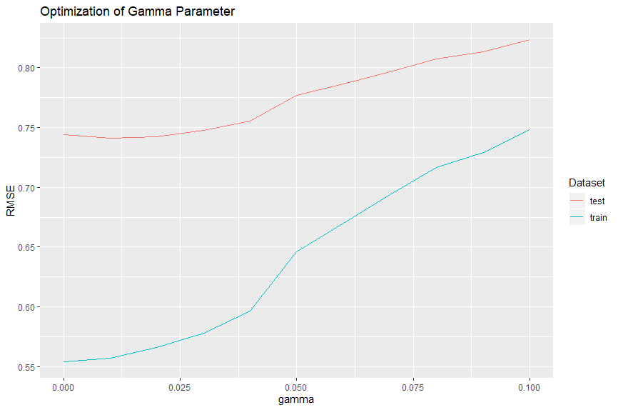

```{r setup, include=FALSE}
knitr::opts_chunk$set(echo = TRUE)
library(dplyr)
library(caret)
library(ggplot2)
library(tidyr)
load(file = 'rda/train.rda')
```

# Introduction

I set out to make a movie recommendation system based on the MovieLens dataset, which provides data on many users and
how they rated many different movies. For my analysis I am using a smaller subset of the dataset as my computer does
not have the memory or processing power to handle the larger dataset. You can find both datasets at

http://files.grouplens.org/datasets/movielens/ml-latest-small.zip

and

http://files.grouplens.org/datasets/movielens/ml-latest.zip

You may also recreate my results by running the 3 scripts download-data, train-validation-split, and model in that
order. I have included these scripts with this report. If the code in these reports is not working, try running at least the first 2 scripts and running the report again. I have also uploaded the datasets with this report in case the website ever stops working.

The last thing I did before beginning work with the data set was to set aside 20% of the data set at random to use for validating my final model to prevent overfitting.

# Modeling

The first thing I did split out another test set of 20% of the data to test various different models on. I then proceeded to graph a histogram of all the ratings in the training set to see the distribution of the data.

```{r echo=FALSE}

#Creating datasets
set.seed(1)
test_index <- createDataPartition(y = train$rating, times = 1, p = 0.2, list = FALSE)
test0 <- train[test_index,]
train <- train[-test_index,]

##Making sure only users and movies with data in the training set appear in the test set.
test <- test0 %>% semi_join(train, by = 'userId') %>% semi_join(train, by = 'movieId')
removed <- anti_join(test0, test)
train <- rbind(train, removed)

train %>% ggplot(aes(x = rating)) + geom_histogram(binwidth = 0.5, color = 'black') + ggtitle('Histogram of Movie Ratings')
```

From here I proceeded to calculate the summary statistics of the ratings.

```{r echo=FALSE}
grandsum <- summarize(train, mean = mean(rating), median = median(rating), sd = sd(rating))
grandsum
```

We can see that the mean value of the ratings is 3.49. I used this as a default prediction to see how accurate a
model is that simply guesses the mean value for any and all ratings. I evaluated the models based on root mean
squared error (RMSE) which is a measurement of how far my predictions are from the actual ratings. Simply guessing
the mean rating for all ratings yields a RMSE of 1.036, which is my benchmark to beat.

The next step in the modeling process was to examine different user and movie averages. It stands to reason that
certain movies are better than other movies and should be receiving higher ratings, and also that certain users are
more critical than others and will give lower ratings. We can see the distribution of both users and movies here.

```{r echo=FALSE}
train %>% group_by(userId) %>% summarize(mean = mean(rating)) %>% ggplot(aes(x = mean)) + 
  geom_histogram(bins = 15, color = 'black') + ggtitle('Distribution of Mean User Ratings')

train %>% group_by(movieId) %>% summarize(mean = mean(rating)) %>% ggplot(aes(x = mean)) + 
  geom_histogram(bins = 15, color = 'black') + ggtitle('Distribution of Mean Movie Ratings')
```

We see that as expected, there is variety in the mean rating across movies and users. My next step is to factor this
variance into my model to hopefully improve my predictions. I chose to first include the difference in users, which
I termed "user bias". User bias was calculated by subtracting the total mean rating of 3.49 from all ratings and then
taking the average rating for each user, which shows the users average difference from the mean rating.

```{r echo=FALSE}
user_bias <- train %>% group_by(userId) %>% summarize(user_bias = mean(rating - grandsum$mean))
user_bias
```

If I add the user bias to the default prediction of 3.49, my predictions should more accurately reflect the true
ratings. Incorporating user bias into the model decreases the RMSE to .93, which is a significant improvement. I now
look to add the movie bias into the model, but the movie bias must account for the fact that I have already added the
user bias. I will calculate the movie bias by subtracting both the overall mean rating and the user bias from each
rating, and the mean of the resulting ratings will show whether certain movies are above or below average.

```{r echo=FALSE}
train <- train %>% left_join(user_bias, by = 'userId')
movie_bias <- train %>% group_by(movieId) %>% summarize(movie_bias = mean(rating - grandsum$mean - user_bias))
movie_bias
```

We can see that movie bias also plays a role as some movies are above average and some are below average. As such, a
new model given by the overall mean + the user bias + the movie bias should improve our predictions. This newest
model gives an RMSE of .89, another improvement.

```{r echo=FALSE}
models <- c('Default', 'User Bias', 'Statistical Model')
rmses <- c(1.036, .933, .887)
df <- data.frame(Model = models, RMSE = rmses)
df %>% arrange(desc(RMSE)) %>% ggplot(aes(x = reorder(Model, RMSE), y = RMSE, fill = Model)) + 
  geom_bar(stat = 'identity') + ggtitle('RMSE by Model') + coord_flip() + theme(legend.position = 'none') + 
  labs(x = 'Model')
```

If we examine our model, we can see something slightly odd. Let us see the top 10 movies as predicted by our model.

```{r echo=FALSE}
train <- train %>% left_join(movie_bias, by = 'movieId')
train <- train %>% mutate(prediction = grandsum$mean + user_bias + movie_bias)
train %>% group_by(title) %>% summarize(mean = mean(prediction)) %>% arrange(desc(mean)) %>% .[1:10,]
```

We get back some blockbusters we would expect like 12 Angry Men, alongside movies that we would not expect to be the top 10 movies such as 3-Iron (Bin-jip). This is because the model is not accounting for the number of ratings each movie has received, and cannot tell the difference between movies that have received 1000 ratings and movies that have received 1 rating. It becomes clear we need to add a regularization term that makes our model less confident in predictions with low sample sizes, causing these predictions to be closer to the mean value.




Here we see that adding a regularization term lambda has a positive effect on the RMSE up until approximately
lambda = 3, at which point we have reached the optimal amount of regularization and any increase also increases the RMSE of our model. So for our model, we will add the regularization term of lambda = 3 which decreases our RMSE down to .87, another improvement.

```{r echo=FALSE}
models <- c('Default', 'User Bias', 'Statistical Model', 'Regularized Model')
rmses <- c(1.036, .933, .887, .866)
df <- data.frame(Model = models, RMSE = rmses)
df %>% arrange(desc(RMSE)) %>% ggplot(aes(x = reorder(Model, RMSE), y = RMSE, fill = Model)) + 
  geom_bar(stat = 'identity') + ggtitle('RMSE by Model') + coord_flip() + theme(legend.position = 'none') +
  labs(x = 'Model')
```

# Machine Learning with Matrix Factorization

At this point I felt the model was not going to improve any further without using machine learning, so I attempted to improve the model using recommenderlab. At first I attempted to create a machine learning algorithm using Matrix Factorization. I create a matrix with the users representing the rows and the movies representing the columns. Said matrix had many missing values as not all users had rated every movie. Here is a small snippet of said matrix.

```{r echo=FALSE}
pca_df <- train %>% select(userId, movieId, rating)

pca_df1 <- pca_df %>% group_by_at(vars(-rating)) %>% mutate(row_id = 1:n()) %>% ungroup() %>% 
  spread(movieId, rating) %>% select(-row_id)
pca_df1 <- pca_df1 %>% distinct(userId, .keep_all = TRUE) 
pca_matrix1 <- pca_df1 %>% select(-userId) %>% as.matrix()
pca_matrix1[1:10, 1:10]
```

I proceeded to normalize the ratings in the matrix by subtracting the mean of each column from said column, and the mean of each row from said row. I then fit a recommender using the recommenderlab package on the normalized data, and predicted the ratings of the normalized test set. The recommender had a RMSE of only .12 on the training set but of .88 on the test set, indicating that the model was seriously overfitting the training data.

I then tried a slightly different approach. Instead of giving the normalized ratings to the recommender, I gave the recommender the variance that was not explained by the statistical model I had created earlier. This was done by subtracting the model prediction from each actual rating, and whatever resulted was data not accounted for by the model. Using this data instead of the normalized ratings, we had a training RMSE of .11 and test RMSE of .87, still massively overfitting. At this point I decided to switch models to a model that could add a regularization term to reduce overfitting.

```{r echo=FALSE}
models <- c('Default', 'User Bias', 'Statistical Model', 'Regularized Model', 'Normalized Factorization', 'Residuals Factorization')
rmses <- c(1.036, .933, .887, .866, .881, .873)
df <- data.frame(Model = models, RMSE = rmses)
df %>% arrange(desc(RMSE)) %>% ggplot(aes(x = reorder(Model, RMSE), y = RMSE, fill = Model)) + 
  geom_bar(stat = 'identity') + ggtitle('RMSE by Model') + coord_flip() + theme(legend.position = 'none') + 
  labs(x = 'Model')
```

# Machine Learning with Funk Singular Value Decomposition

This approach is similar to matrix factorization in that it requires a matrix, but instead of finding its principal components, it will break down the matrix into two vectors whose crossproduct returns as close to the original matrix as possible. Running singular value decomposition on the normalized ratings gave a training RMSE of .77 and a test RMSE of .87. There was much less overfitting occurring in this model, but unfortunately it also didn't outperform our simple statistical model.

I then ran singular value decomposition on the variance not explained by the statistical model. the training RMSE was .76 and the test RMSE was .84, an improvement and our best RMSE to date. I decided to select this model to move forward with and optimize the parameters for. There are several parameters to optimize for this algorithm: K, the minimum #of ratings a movie needs to have to be considered; gamma, the regularization parameter; and lambda, the learning rate.

Here is the performance based on each optimization I ran.





We can see that low values of K are optimal, so I chose to use the default value of 10. For lambda, I chose a value of .003 which is where the curve for the test set begins to flatten indicating no further improvement. However, this has introduced some overfit as there is significant distance between the training and test sets. To adjust for this, I chose a slightly high value of gamma of .05 which is not optimal on the test set, but partially closes the gap between training and test sets.

Here we have achieved an RMSE of .78, and the last step is to check this against the validation set to see if the model is overfit or if it will hold up on data it has never seen.

```{r echo=FALSE}
models <- c('Default', 'User Bias', 'Statistical Model', 'Regularized Model', 'Normalized Factorization', 'Residuals Factorization', 'Normalized SVD', 'Residuals SVD', 'Optimized SVD')
rmses <- c(1.036, .933, .887, .866, .881, .873, .867, .837, .78)
df <- data.frame(Model = models, RMSE = rmses)
df %>% arrange(desc(RMSE)) %>% ggplot(aes(x = reorder(Model, RMSE), y = RMSE, fill = Model)) + 
  geom_bar(stat = 'identity') + ggtitle('RMSE by Model') + coord_flip() + theme(legend.position = 'none') + 
  labs(x = 'Model')
```

# Validation Data Set

The validation dataset has not been used at all in the analysis. I transformed the validation set into variance not predicted by the statistical model and ran the funkSVD model on the result. The end result was an RMSE of .806, only slightly worse than the performance on the test set and still better than our previous best model. This indicates that the model is not badly overfit and likely has predictive power in the future. Here is a summary of all the models and their performance

```{r echo=FALSE}
models <- c('Default', 'User Bias', 'Statistical Model', 'Regularized Model', 'Normalized Factorization', 'Residuals Factorization', 'Normalized SVD', 'Residuals SVD', 'Optimized SVD', 'Model Validation')
rmses <- c(1.036, .933, .887, .866, .881, .873, .867, .837, .78, .806)
df <- data.frame(Model = models, RMSE = rmses)
df %>% arrange(desc(RMSE)) %>% ggplot(aes(x = reorder(Model, RMSE), y = RMSE, fill = Model)) + 
  geom_bar(stat = 'identity') + ggtitle('RMSE by Model') + coord_flip() + theme(legend.position = 'none') + 
  labs(x = 'Model')
```


